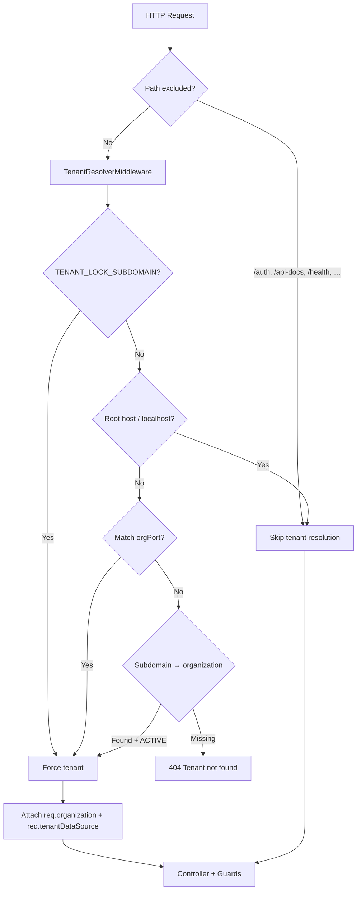

# Backend Documentation

## Overview

GhoulHR backend is a **NestJS 11** multi-tenant HR API with:

- **Master database** — organizations, platform users (`users`), refresh sessions
- **Per-tenant PostgreSQL databases** — employees, settings, HR onboarding artifacts
- **Cookie-first authentication** — rotating refresh sessions (HttpOnly cookies + optional Bearer for tooling)
- **Runtime tenant bootstrap** — tenant DB provisioning, migrations, org-port assignment, startup reconciliation

Primary entry: `src/main.ts`  
App wiring: `src/app.module.ts`

## Stack

| Layer | Technology |
|-------|------------|
| Framework | NestJS 11, TypeScript |
| ORM / DB | TypeORM 0.3, PostgreSQL (`pg`) |
| Validation | `class-validator`, `class-transformer` (global `ValidationPipe`) |
| API docs | Swagger at `/api-docs` |
| Config | `@nestjs/config` (`.env` / `.env.production`) |
| Auth transport | `cookie-parser`, custom HS256 JWT (HMAC) |

Node **≥ 20**, npm **≥ 10**.

## Project Structure

```
backend/ghoulhr-backend/
├── src/
│   ├── main.ts                    # HTTP bootstrap, CORS, Swagger, body limits
│   ├── app.module.ts              # Root module + global tenant middleware
│   ├── app.controller.ts          # GET / health
│   ├── auth/                      # Platform + tenant auth, guards, refresh sessions
│   ├── users/                     # Master users (SUPER_ADMIN, ORG_ADMIN, …)
│   ├── organizations/           # Tenant lifecycle (SUPER_ADMIN)
│   ├── employees/                 # Tenant employee CRUD + HR onboarding
│   ├── settings/                  # Tenant org/employee/attendance/location/leave settings
│   ├── roles/                     # Platform Role enum
│   ├── database/                  # Master TypeORM config + BaseEntity
│   ├── core/database/             # TenantConnectionManager, MigrationRunnerService
│   ├── common/                    # Tenant middleware, password/encryption, @Roles
│   ├── modules/email/             # Admin credential emails (stub / logs today)
│   └── migrations/
│       ├── *.ts                   # Master DB migrations (auto-run on boot)
│       └── tenant/*.ts            # Tenant DB migrations (run on org create / CLI)
├── proxy/domain-proxy.cjs         # Subdomain → org port reverse proxy
├── scripts/                       # Tenant migration + PM2 sync helpers
├── docs/                          # db-standards.md, tenant-data-dictionary.md
├── ecosystem.base.config.js       # PM2: superadmin API + domain proxy
└── test/                          # Jest unit/e2e
```

## Request Flow



### Runtime bootstrap (`main.ts`)

On listen:

1. `cookie-parser`
2. Optional `trust proxy` (`TRUST_PROXY=true` or `NODE_ENV=production`)
3. JSON/urlencoded body limit — default `100mb` (`JSON_BODY_LIMIT`; HR onboarding sends base64 documents)
4. CORS — `WEB_APP_ORIGINS` allowlist, else `localhost` / `*.localhost`
5. Global `ValidationPipe` — `whitelist`, `forbidNonWhitelisted`, `transform`
6. Swagger at `/api-docs` (Bearer documented as optional tooling fallback)
7. Listen on `PORT` (default `3000`)

### Application bootstrap (modules)

Two `OnApplicationBootstrap` hooks run after the app starts:

| Service | Behavior |
|---------|----------|
| `SuperAdminBootstrapService` | `AuthService.ensureDefaultSuperAdmin()` — seeds default SUPER_ADMIN when configured and none exists |
| `OrganizationRuntimeBootstrapService` | `OrganizationsService.ensureAllOrganizationsRuntimeReady()` — reconciles tenant DB connections/migrations for existing orgs |

## Multi-Tenancy

### Master vs tenant

| Store | Connection | Entities (examples) |
|-------|------------|---------------------|
| Master | `DatabaseModule` → `DB_NAME` | `organizations`, `users`, `refresh_sessions` |
| Tenant | `TenantConnectionManager` per `organization.dbName` | `employees`, `organization_settings`, `departments`, … |

Master migrations run automatically at startup (`migrationsRun: true`, compiled `dist/src/migrations/*.js`).

Tenant migrations run when:

- A new organization is created (`OrganizationsService.create`)
- Startup reconciliation (`ensureAllOrganizationsRuntimeReady`)
- CLI: `npm run tenant:migrate`

### Tenant resolution

Middleware: `src/common/middleware/tenant-resolver.middleware.ts`  
Applied globally via `AppModule.configure()`.

**Excluded paths** (no tenant binding):

- `/auth`, `/api/auth`, `/api/super-admin`, `/api-docs`, `/health`

**Resolution order:**

1. `TENANT_LOCK_SUBDOMAIN` — force single tenant (used for dedicated tenant API instances / PM2 per-org processes)
2. Root domain / `localhost` without subdomain — skip (platform / super-admin)
3. Host **port** matches `organization.orgPort` — bind tenant (local multi-port dev)
4. **Subdomain** lookup in master DB — skip if subdomain equals `API_SUBDOMAIN` (default `api`)
5. Attach `req.organization` and `req.tenantDataSource` via `TenantConnectionManager.getOrCreateConnection()`

**Rejected cases:**

- Unknown subdomain → `404`
- Non-`ACTIVE` organization → `403` suspended
- Tenant DB connection failure → `404` database not available

### Tenant connection pool

`TenantConnectionManager` caches `DataSource` per `dbName`, uses per-org credentials (`dbHost`, `dbUser`, `dbPassword`) with env fallbacks, pool size from `TENANT_CONNECTION_POOL_SIZE` (default `10`).

Tenant entity globs (no `synchronize`):

- `src/employees/**/*.entity.ts`
- `src/settings/entities/*.entity.ts`
- Migrations: `dist/src/migrations/tenant/*.js`

### Tenant schema layout

Historically, migrations introduced PostgreSQL schemas (`core`, `master`, `feature`, `audit`, `config`). Migration `1776000000004-revert-to-public-schema` moves all tenant tables back to **`public`** for simpler TypeORM mapping. New and reconciled tenant DBs use a single `public` schema.

See also: `docs/tenant-data-dictionary.md`, `docs/db-standards.md`.

## Modules

### App (health)

| Method | Path | Auth | Notes |
|--------|------|------|-------|
| `GET` | `/` | None | Returns health string (`AppController`) |

`/health` is listed in tenant-middleware exclusions but is **not** implemented as a dedicated route today.

---

### Auth (`AuthModule` — global)

Cookie names (defaults): `ghoulhr_access`, `ghoulhr_refresh`  
Tokens: custom HS256 via `createHmac` in `AuthService`  
Refresh: persisted in master `refresh_sessions` (`sessionKind`: `master` | `employee`)

#### Platform routes — `AuthController` (`/auth`)

| Method | Path | Description |
|--------|------|-------------|
| `GET` | `/auth/session` | Current user from access cookie (or Bearer) |
| `POST` | `/auth/refresh` | Rotate refresh session, re-issue access cookie |
| `POST` | `/auth/logout` | Revoke refresh session, clear cookies |
| `POST` | `/auth/register` | Register into master `users` (tenant-aware via middleware org) |
| `POST` | `/auth/login` | Login — tenant user first, SUPER_ADMIN fallback on root |
| `POST` | `/auth/superadmin/bootstrap` | First SUPER_ADMIN via `x-bootstrap-admin-key` |

Register/login/bootstrap responses set HttpOnly cookies; body returns `{ user }` only.

`POST /auth/register` — header `x-bootstrap-admin-key` required when assigning `SUPER_ADMIN`.

#### Tenant employee routes — `TenantAuthController` (`/auth`)

Requires tenant middleware context for `employee/login`.

| Method | Path | Guard | Description |
|--------|------|-------|-------------|
| `POST` | `/auth/employee/login` | None | Employee login against tenant `employees` table |
| `POST` | `/auth/change-password` | `TenantAuthGuard` | Change password for authenticated employee |

Employee login may return `requiresPasswordChange: true` when `mustChangePassword` is set.

#### Guards

| Guard | File | Behavior |
|-------|------|----------|
| `AuthTokenGuard` | `auth/guards/auth-token.guard.ts` | Cookie or Bearer access token → `req.user` |
| `TenantAuthGuard` | `auth/guards/tenant-auth.guard.ts` | Validates token; enforces `organizationSubdomain` match when `req.organization` present |
| `RolesGuard` | `auth/guards/roles.guard.ts` | `@Roles()` — accepts platform `Role` or tenant `EmployeeRole` |

---

### Organizations (`OrganizationsModule`)

**Guard:** `AuthTokenGuard` + `RolesGuard` + `@Roles(SUPER_ADMIN)` on controller.

| Method | Path | Description |
|--------|------|-------------|
| `POST` | `/organizations` | Create org + tenant DB + migrations + optional ORG_ADMIN |
| `GET` | `/organizations` | List all |
| `GET` | `/organizations/dashboard/stats` | Super-admin dashboard aggregates |
| `GET` | `/organizations/stats` | Alias for dashboard stats |
| `GET` | `/organizations/deleted` | Soft-deleted orgs |
| `PATCH` | `/organizations/id/:id` | Update |
| `DELETE` | `/organizations/id/:id` | Soft delete |
| `PATCH` | `/organizations/id/:id/restore` | Restore |
| `GET` | `/organizations/id/:id` | By id |
| `GET` | `/organizations/:subdomain` | By subdomain |

**Create flow:**

1. Insert master `organizations` row (`dbName`, `dbHost`, `dbUser`, `dbPassword`, `orgPort`)
2. `CREATE DATABASE` for tenant
3. Connect tenant DS + `MigrationRunnerService.runMigrations()`
4. If `adminEmail` set — provision tenant ORG_ADMIN (`EmployeesService`) and log credentials via `EmailService` (stub)
5. Trigger optional SSL auto-provisioning for `${subdomain}.${SSL_AUTO_BASE_DOMAIN}` (non-blocking)
6. On failure — drop tenant DB + delete master row

`orgPort` assigned from `ORG_PORT_START` (default range starts `6000`).  
Default provisioned admin password: `admin@123` (until changed).

---

### Employees (`EmployeesModule`)

**Guard:** `TenantAuthGuard` + `RolesGuard` on all routes.

Route order matters: static segments (`check-duplicate`, `hr-onboarding`) are registered before `:id`.

| Method | Path | Roles | Description |
|--------|------|-------|-------------|
| `GET` | `/employees` | ORG_ADMIN, MANAGER | List employees (enriched rows) |
| `POST` | `/employees/check-duplicate` | ORG_ADMIN | Email / phone duplicate check |
| `POST` | `/employees/hr-onboarding` | ORG_ADMIN | Modular HR onboarding (transaction) |
| `PATCH` | `/employees/:id/hr-onboarding` | ORG_ADMIN | Update via onboarding payload |
| `GET` | `/employees/:id` | ORG_ADMIN, MANAGER | Employee by id |
| `POST` | `/employees` | ORG_ADMIN | Classic create (settings-aware validation) |
| `POST` | `/employees/:id/reset-password` | ORG_ADMIN | Admin password reset |
| `PATCH` | `/employees/:id` | ORG_ADMIN | Partial update (`UpdateEmployeeDto`) |

#### HR onboarding (`createHrOnboarding` / `updateHrOnboarding`)

Single DB transaction persists modular sections:

| Section | Persistence |
|---------|-------------|
| Basic / employment | `employees` + `employee_employment_details` |
| Experience | Fields on employment detail |
| Payroll | `employee_salary_details` |
| Bank | `employee_bank_details` (encrypted account number) |
| Compliance | PAN/Aadhaar encrypted on `employees`; passport/UAN/PF/ESI plain columns |
| Emergency contact | `employee_emergency_contacts` |
| Documents | `employee_documents` — `storageDriver: inline_base64`, encrypted payload, max ~5MB each, max 20 files |
| Access | `employee_access_control` (portal role label, HRMS flags) |
| Audit | `employee_audit_logs` |

Sensitive fields use `FieldEncryptionService` (`FIELD_ENCRYPTION_KEY`, fallback `JWT_SECRET` / `AUTH_TOKEN_SECRET`).

Employee codes respect settings: `employee.id_prefix`, `employee.auto_generate_id`.

Platform roles on employee: `ORG_ADMIN`, `MANAGER`, `EMPLOYEE` (`EmployeeRole` enum).

---

### Settings (`SettingsModule`)

**Guard:** `TenantAuthGuard` on all routes.  
Specific routes **must** precede `GET/POST :key` and `GET` (bare).

| Method | Path | Description |
|--------|------|-------------|
| `GET` | `/settings/profile` | Org profile (key-value mapped to frontend shape) |
| `POST` | `/settings/profile` | Update org profile |
| `GET` | `/settings/employee` | Employee module settings + departments/designations |
| `POST` | `/settings/employee` | Bulk update employee settings |
| `GET` | `/settings/attendance` | Attendance settings + work shifts |
| `POST` | `/settings/attendance` | Bulk update attendance; persists shifts to `work_shift_configurations` |
| `GET` | `/settings/locations` | Branch / location configurations |
| `POST` | `/settings/locations` | Replace location configurations |
| `GET` | `/settings/leave-config` | Leave type master rows (per branch) |
| `POST` | `/settings/leave-config` | Replace leave configurations |
| `GET` | `/settings` | All `organization_settings` rows |
| `GET` | `/settings/:key` | Single setting by internal key |
| `POST` | `/settings` | Upsert `{ key, value }` |

#### Setting keys (`settings.constants.ts`)

| Area | Internal keys (examples) |
|------|--------------------------|
| Org profile | `org.name`, `org.logo`, `org.timezone`, `org.currency`, `org.date_format`, `org.language` |
| Employee | `employee.id_prefix`, `employee.auto_generate_id`, `employee.required_fields`, `employee.default_probation_period`, `employee.departments`, `employee.designations` |
| Attendance | `attendance.working_days`, `attendance.shifts` (legacy JSON; migrated to `work_shift_configurations`), grace/half-day/overtime/geo/IP settings |

Normalized tables (also exposed via dedicated endpoints):

- `departments`, `designations`, `designation_departments`
- `locations_configurations`
- `leave_configurations`
- `work_shift_configurations` (linked to locations; managed through attendance settings APIs)
- `organization_calendars`, `organization_calendar_holidays` (org holiday calendar module)

#### Organization calendar (`OrganizationCalendarController`)

| Method | Path | Role | Description |
|--------|------|------|-------------|
| `GET` | `/settings/organization/calendar?year=` | Tenant | Calendar metadata + holidays for year |
| `POST` | `/settings/organization/calendar/holidays` | `ORG_ADMIN` | Add holiday |
| `PATCH` | `/settings/organization/calendar/holidays/:id` | `ORG_ADMIN` | Update holiday |
| `DELETE` | `/settings/organization/calendar/holidays/:id` | `ORG_ADMIN` | Soft-delete holiday |
| `POST` | `/settings/organization/calendar/publish` | `ORG_ADMIN` | Publish calendar for year |

---

### ESS — Employee self-service (`EssModule`)

**Guard:** `TenantAuthGuard` on all routes.

| Method | Path | Description |
|--------|------|-------------|
| `GET` | `/ess/leave/balances?year=` | Per-type balances (`granted`, `consumed`, `pending`, `balance`) + policy `rules` |
| `GET` | `/ess/leave/balances/:leaveConfigurationId?year=` | Detail: `summary` KPIs, `monthlyChart`, `transactions` ledger for one leave type |
| `GET` | `/ess/leave/types` | Bookable leave types, approvers, `rules` |
| `GET` | `/ess/leave/preview-days` | Preview leave days (respects weekends + published holidays) |
| `GET` | `/ess/leave/requests?status=PENDING\|APPROVED` | Own requests for Pending / History tabs |
| `POST` | `/ess/leave/requests` | Submit leave (transaction: `leave_requests` + `pendingDays`) |
| `POST` | `/ess/leave/requests/:id/withdraw` | Withdraw pending request (reverts `pendingDays`) |
| `GET` | `/ess/holidays?year=` | Published org holiday calendar (location-aware) |
| `GET` | `/ess/leave/calendar?year=&month=&filter=` | Month view with holidays + leave markers |
| `GET` | `/ess/leave/transactions?date=&filter=` | Leave rows for a date |
| `GET` | `/ess/home` | Dashboard including upcoming holidays |
| `GET` | `/ess/notifications` | In-app notifications |

**Operational tables:** `leave_requests`, `employee_leave_balances`, `employee_notifications`. **Master:** `leave_configurations`, `organization_calendars`, `organization_calendar_holidays`, `employees`, `employee_documents`.

---

### Users (`UsersModule`)

Master-table service used by `AuthService` and `OrganizationsService`. No public HTTP controller.

- Unique per `(email, organizationId)`
- Roles: `SUPER_ADMIN`, `ORG_ADMIN`, `MANAGER`, `EMPLOYEE` (`roles.enum.ts`)
- Status: `ACTIVE` / inactive via `UserStatus`

---

### Email (`modules/email`)

`EmailService` — logs admin/employee credential payloads today; intended for future SMTP/provider integration.

## Tenant Data Model (tables)

All tenant tables live in **`public`** unless an older DB is mid-migration.

| Table | Purpose |
|-------|---------|
| `employees` | Core profile, auth password, role, department/designation FKs, encrypted PAN/Aadhaar |
| `employee_employment_details` | Employment type, managers, work mode, experience fields |
| `employee_salary_details` | CTC, structure, PF/ESIC flags |
| `employee_bank_details` | Encrypted account number + last four |
| `employee_documents` | Onboarding uploads |
| `employee_emergency_contacts` | Emergency contacts |
| `employee_access_control` | Portal access + MFA/welcome flags |
| `employee_audit_logs` | HR change audit trail |
| `departments` | Department master |
| `designations` | Designation master |
| `designation_departments` | Allowed designation ↔ department pairs |
| `organization_settings` | Legacy-compatible key-value JSON store |
| `settings_catalog` / `tenant_settings` | Catalog-driven settings (normalization path) |
| `locations_configurations` | Branch/location master |
| `leave_configurations` | Leave types per branch |
| `work_shift_configurations` | Shifts tied to `locationId` |

Master tables: `organizations`, `users`, `refresh_sessions`.

## Migrations

### Master (`src/migrations/`)

| Migration | Purpose |
|-----------|---------|
| `1768936823119-create-organizations` | Organizations table |
| `1768942400000-create-users` | Users table |
| `1768949800000-expand-organizations-profile` | Extended org profile columns |
| `1769000000000-add-tenant-db-fields-to-organizations` | `dbName`, credentials |
| `1769100000000-add-org-port-to-organizations` | `org_port` |
| `1780100000000-create-refresh-sessions` | Refresh session store |

### Tenant (`src/migrations/tenant/`)

Chronological highlights:

| Migration | Purpose |
|-----------|---------|
| `1769000000001` | Employees table |
| `1769000000002` | Employee auth columns |
| `1770000000000` | Organization settings |
| `1771000000000` | Settings timestamp fix |
| `1772000000000` | HR onboarding module tables |
| `1773000000000` | Audit log base columns |
| `1774000000000` | Emergency contacts |
| `1775000000000` | Experience fields |
| `1776000000000`–`0002` | Tenant normalization v2 |
| `1776000000001` | Drop legacy dept/designation columns on employees |
| `1776000000004` | Revert partitioned schemas → `public` |
| `1777000000000` | `work_shifts` (superseded) |
| `1778000000000` | Location configurations |
| `1779000000000` | `work_shift_configurations` (replaces `work_shifts`) |
| `1780000000000` | Leave configurations |
| `1781000000000` | Leave configuration extended fields |

Run all tenants: `npm run tenant:migrate` → `scripts/run-tenant-migrations.cjs`.

## Security Notes

- **Cookie-first auth** — access/refresh HttpOnly; host-only cookies (no `Domain` attribute)
- **Bearer fallback** — Swagger/tooling only; same guards read cookie first
- **Refresh rotation** — hashed tokens in master DB; revoke on logout
- **Tenant isolation** — middleware binding + `TenantAuthGuard` subdomain match
- **Field encryption** — PAN, Aadhaar, bank account, document payloads at rest
- **Bootstrap protection** — `BOOTSTRAP_ADMIN_KEY` for super-admin bootstrap/register escalation
- **Role assignment** — `SUPER_ADMIN` registration requires bootstrap key
- **Password hashing** — scrypt (platform users in `AuthService`; employees via `PasswordService`)
- **TypeORM** — `synchronize: false` everywhere (never enable in production)

## Environment Variables

### Database

| Variable | Purpose |
|----------|---------|
| `DB_HOST`, `DB_PORT`, `DB_USER`, `DB_PASS`, `DB_NAME` | Master PostgreSQL |
| `DB_LOGGING` | Master query logging (`true`/`false`) |

### Server / HTTP

| Variable | Purpose |
|----------|---------|
| `PORT` | API listen port (default `3000`) |
| `NODE_ENV` | `production` loads `.env.production`; affects cookies, trust proxy, tenant logging |
| `TRUST_PROXY` | Express `trust proxy` when `true` |
| `JSON_BODY_LIMIT` | Request body cap (default `100mb`) |
| `WEB_APP_ORIGINS` | Comma-separated CORS allowlist (credentials enabled) |

### Auth / cookies

| Variable | Purpose |
|----------|---------|
| `JWT_SECRET` / `AUTH_TOKEN_SECRET` | HMAC signing (encryption fallback) |
| `JWT_ACCESS_EXPIRES_IN` / `JWT_EXPIRES_IN` | Access token TTL (prefer `JWT_ACCESS_EXPIRES_IN`, e.g. `15m`) |
| `JWT_REFRESH_EXPIRES_IN` | Refresh token sliding TTL (e.g. `7d`) |
| `AUTH_SESSION_MAX_LIFETIME` | Absolute session cap from login (e.g. `24h`); enforced server-side |
| `AUTH_ACCESS_COOKIE_NAME` / `AUTH_REFRESH_COOKIE_NAME` | Cookie names |
| `COOKIE_SECURE` | Force `Secure` cookies |
| `COOKIE_SAMESITE` | `lax` (default), `strict`, or `none` |

### Bootstrap / defaults

| Variable | Purpose |
|----------|---------|
| `BOOTSTRAP_ADMIN_KEY` | Super-admin bootstrap + elevated register |
| `DEFAULT_SUPERADMIN_EMAIL` / `DEFAULT_SUPERADMIN_PASSWORD` | Auto seed SUPER_ADMIN |
| `DEFAULT_ORGANIZATION_NAME` / `DEFAULT_ORGANIZATION_SUBDOMAIN` | Default org for seed user |

### Multi-tenant runtime

| Variable | Purpose |
|----------|---------|
| `TENANT_CONNECTION_POOL_SIZE` | Per-tenant pool (default `10`) |
| `TENANT_LOCK_SUBDOMAIN` | Pin API instance to one tenant |
| `ORG_PORT_START` | First port for new orgs (default `6000`) |
| `API_SUBDOMAIN` | Subdomain to skip tenant binding (default `api`) |

### Security

| Variable | Purpose |
|----------|---------|
| `FIELD_ENCRYPTION_KEY` | AES key for sensitive employee fields (64-char hex) |

### Proxy / PM2 (optional local prod-like setup)

| Variable | Purpose |
|----------|---------|
| `PROXY_PORT` | Domain proxy port (default `8080`) |
| `SUPERADMIN_PORT` | Super-admin API port (default `3000`) |
| `APP_DOMAIN` | Base domain for subdomain routing |
| `PROXY_CACHE_TTL_MS` | Org lookup cache in proxy |

### SSL auto-provisioning (optional)

| Variable | Purpose |
|----------|---------|
| `SSL_AUTO_PROVISION_ENABLED` | Enable SSL provisioning on org create (`true`/`false`) |
| `SSL_AUTO_BASE_DOMAIN` | Base domain appended to subdomain (e.g. `peopleaiq.com`) |
| `SSL_AUTO_PROVISION_COMMAND` | Optional command with `{fqdn}` placeholder (example: `sudo /usr/local/bin/provision-tenant-ssl.sh {fqdn}`) |
| `SSL_AUTO_PROVISION_SCRIPT` | Script path if command not set (default `/usr/local/bin/provision-tenant-ssl.sh`) |
| `SSL_AUTO_PROVISION_TIMEOUT_MS` | Max execution time in milliseconds (default `180000`) |

Reference script: `scripts/provision-tenant-ssl.sh`.

## NPM Scripts

| Script | Command |
|--------|---------|
| `build` | `nest build` |
| `start` / `start:dev` / `start:debug` / `start:prod` | Nest run modes (`start:prod` → `node dist/src/main.js`) |
| `lint` | ESLint |
| `test` / `test:watch` / `test:cov` / `test:e2e` | Jest |
| `format` | Prettier |
| `proxy:start` | `node ./proxy/domain-proxy.cjs` |
| `pm2:start:base` | Super-admin + proxy via PM2 |
| `pm2:sync:orgs` | Generate per-org PM2 apps from master DB |
| `pm2:save` | Persist PM2 process list |
| `tenant:migrate` | Run pending migrations on all tenant DBs |

## Local Multi-Tenant Topology (optional)

1. **Super-admin API** — root port (`3000`), no tenant lock  
2. **Domain proxy** — port `8080`, routes `{subdomain}.localhost` → `organization.orgPort`  
3. **Per-org API processes** — `pm2:sync:orgs` starts Nest with `TENANT_LOCK_SUBDOMAIN={subdomain}` and `PORT={orgPort}`

`proxy/domain-proxy.cjs` reads `organizations` from master PostgreSQL and forwards HTTP/WebSocket to the matching `orgPort`.

## Related Documentation

- `docs/db-standards.md` — naming and migration conventions  
- `docs/tenant-data-dictionary.md` — table-level dictionary (note: schema names in doc reflect historical layout; runtime uses `public` after revert migration)

## RBAC (Two-Tier Access Control)

See `docs/RBAC.md` for full architecture.

- **Layer 1 (master DB):** `platform_modules`, `organization_module_entitlements` — super admin enables/disables modules per org via `GET/PATCH /organizations/id/:id/modules`.
- **Layer 2 (tenant DB):** `rbac_roles`, `rbac_permissions`, `rbac_role_permissions`, `rbac_employee_role_assignments` — org admin manages roles via `/rbac/*`.
- **Effective access:** `org entitlement ∩ user permission` enforced by `PermissionsGuard` + `@RequirePermissions()`.
- **Session:** `GET /auth/session` returns `{ user, entitledModules, permissions, roles }`.
- **Feature flags:** `RBAC_ENFORCED`, `RBAC_SETTINGS_ENFORCED`, `RBAC_EMPLOYEES_ENFORCED` (default true).

## Current-State Notes

- Swagger Bearer auth is optional; production clients should use cookies with `credentials: include`.
- `EmailService` does not send real email yet — credentials are logged server-side.
- `GET /` is the implemented health endpoint; `/health` is only excluded from tenant middleware.
- Platform `Role.MANAGER` exists on master users but tenant employee roles use `EmployeeRole`; align new features with tenant enums for employee APIs.
- Attendance **shifts** in API responses are backed by `work_shift_configurations`; legacy JSON in `attendance.shifts` is migrated on read when needed.
