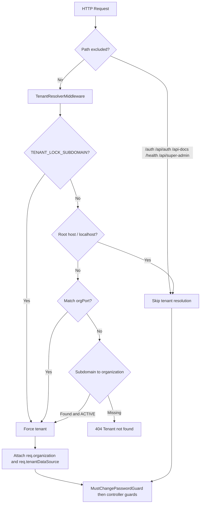

# Backend Documentation

Handbook for the peopleAIQ (GhoulHR) NestJS API. It describes **wired** behavior: modules imported by `AppModule`, HTTP routes, guards/permissions, tenant tables, and honest placeholders.

Swagger title: **peopleAIQ API** (`/api-docs`).

## Overview

The backend is a **NestJS 11** multi-tenant HR API with:

- **Master database** — organizations, platform users, refresh sessions, handoff tokens, subscriptions, platform modules / entitlements, marketing lead tables
- **Per-tenant PostgreSQL databases** — employees, settings, ESS (leave/attendance/regularization/timesheet), performance, skills, document centre, tenant RBAC
- **Cookie-first authentication** — rotating refresh sessions (HttpOnly cookies; optional Bearer for tooling)
- **Two-tier access** — org module entitlements ∩ employee permission codes (`PermissionsGuard`)
- **Subscriptions** — `SubscriptionGuard` on tenant APIs; midnight expiry cron
- **Runtime tenant bootstrap** — tenant DB provision, migrations, org-port assignment, startup reconciliation
- **S3 storage** and **AWS SES** email
- **Scheduled jobs** — leave-approval reminders, subscription expiry

Primary entry: `src/main.ts`  
App wiring: `src/app.module.ts`

No global URI prefix. CORS allows `x-org-id` (settings) and `x-bootstrap-admin-key`.

## Stack

| Layer | Technology |
|-------|------------|
| Framework | NestJS 11, TypeScript |
| ORM / DB | TypeORM 0.3, PostgreSQL (`pg`) |
| Validation | `class-validator`, `class-transformer` (global `ValidationPipe`) |
| API docs | Swagger UI at `/api-docs` |
| Config | `@nestjs/config` (`.env` / `.env.production`) |
| Auth transport | `cookie-parser`, custom HS256 JWT (HMAC) |
| Jobs | `@nestjs/schedule` |
| Files | AWS S3 SDK, multer, adm-zip |
| Email | nodemailer → AWS SES SMTP |

Node **≥ 20**, npm **≥ 10**.

## Project structure

```text
ghoulhr-backend/
├── src/
│   ├── main.ts
│   ├── app.module.ts              # Root imports + global tenant middleware
│   ├── app.controller.ts          # GET /
│   ├── auth/                      # Cookies, session, handoff, tenant login, APP_GUARD
│   ├── users/                     # Master users (no HTTP controller)
│   ├── organizations/             # Tenant lifecycle (SUPER_ADMIN)
│   ├── subscriptions/             # Org subscriptions + expiry cron + SubscriptionGuard
│   ├── leads/                     # Super-admin read of marketing leads
│   ├── employees/                 # Directory, onboarding, reporting managers
│   ├── settings/                  # Org/employee/attendance/locations/leave/timesheet + calendar
│   ├── ess/                       # Leave, attendance (+ regularization), timesheet, home,
│   │                              # notifications, holidays, approvals, performance (+ master)
│   ├── rbac/                      # Tenant RBAC admin + catalog + PermissionsGuard
│   ├── skills/                    # Skill master, ESS skills, HR search
│   ├── document-centre/
│   ├── storage/                   # S3 upload / download / preview / purge
│   ├── hr-dashboard/              # GET /dashboard/hr
│   ├── roles/                     # Platform Role enum (SUPER_ADMIN, …)
│   ├── database/                  # Master TypeORM config + BaseEntity
│   ├── core/database/             # TenantConnectionManager, MigrationRunnerService
│   ├── common/                    # Tenant middleware, password, encryption, @Roles
│   ├── modules/email/             # AWS SES (see EMAIL.md)
│   └── migrations/
│       ├── *.ts                   # Master DB (auto-run on boot)
│       └── tenant/*.ts            # Tenant DB (org create / CLI / reconcile)
├── proxy/domain-proxy.cjs
├── scripts/
├── docs/                          # db-standards.md, tenant-data-dictionary.md, RBAC.md
├── ecosystem.base.config.js
└── test/
```

Timesheet and performance **runtime** live under `ess/`. Performance **master** HTTP is `ess/performance/performance-master.controller.ts` with prefix `settings/performance`. There is no top-level `payroll` or `tracking` module.

## Request flow


```mermaid
flowchart TD
  A[HTTP Request] --> B{Path excluded?}
  B -->|/auth /api/auth /api-docs /health /api/super-admin| C[Skip tenant resolution]
  B -->|No| D[TenantResolverMiddleware]
  D --> E{TENANT_LOCK_SUBDOMAIN?}
  E -->|Yes| F[Force tenant]
  E -->|No| G{Root host / localhost?}
  G -->|Yes| C
  G -->|No| H{Match orgPort?}
  H -->|Yes| F
  H -->|No| I{Subdomain to organization}
  I -->|Found and ACTIVE| F
  I -->|Missing| J[404 Tenant not found]
  F --> K[Attach req.organization and req.tenantDataSource]
  K --> L[MustChangePasswordGuard then controller guards]
  C --> L
```

**Excluded paths** (`tenant-resolver.middleware.ts`): `/auth`, `/api/auth`, `/api/super-admin`, `/api-docs`, `/health`.

`/health` is excluded but **not implemented**. Health is `GET /`.

### HTTP bootstrap (`main.ts`)

On listen:

1. `cookie-parser`
2. Optional `trust proxy` (`TRUST_PROXY=true` or `NODE_ENV=production`)
3. JSON/urlencoded body limit — default `100mb` (`JSON_BODY_LIMIT`)
4. CORS — `WEB_APP_ORIGINS` allowlist (wildcards supported), else `localhost` / `*.localhost`; `credentials: true`
5. Global `ValidationPipe` — `whitelist`, `forbidNonWhitelisted`, `transform`
6. Swagger at `/api-docs` (Bearer documented as optional tooling fallback)
7. Listen on `PORT` (default `3000`)

### Application bootstrap

| Service | When | Behavior |
|---------|------|----------|
| `SuperAdminBootstrapService` | `OnApplicationBootstrap` | `ensureDefaultSuperAdmin()` when env is set and none exists |
| `OrganizationRuntimeBootstrapService` | `OnApplicationBootstrap` | `ensureAllOrganizationsRuntimeReady()` — tenant connections + migrations |
| `PendingLeaveApprovalReminderCronService` | Hourly | Month-end leave-approval reminders across tenants |
| `SubscriptionExpiryCronService` | Midnight | `markExpiredSubscriptions()` on master |

Global `APP_GUARD`: `MustChangePasswordGuard` — authenticated employees with `mustChangePassword` may only hit change-password (and a small allowlist of auth paths).

## Multi-tenancy

### Master vs tenant

| Store | Connection | Examples |
|-------|------------|----------|
| Master | `DatabaseModule` → `DB_NAME` | `organizations`, `users`, `refresh_sessions`, `auth_handoff_tokens`, `organization_subscriptions`, `platform_modules`, `organization_module_entitlements`, `contact_us`, `request_for_demo` |
| Tenant | `TenantConnectionManager` per `organization.dbName` | employees, settings, ESS, skills, document centre, tenant RBAC |

Master migrations: `migrationsRun: true`, compiled `dist/src/migrations/*.js`.

Tenant migrations run on org create, startup reconciliation, and `npm run tenant:migrate`.

### Tenant resolution

Middleware: `src/common/middleware/tenant-resolver.middleware.ts` via `AppModule.configure()`.

**Order:**

1. `TENANT_LOCK_SUBDOMAIN` — pin a PM2/org-port process to one tenant
2. Root domain / `localhost` without subdomain — skip (platform / super-admin)
3. Host **port** matches `organization.orgPort`
4. **Subdomain** lookup — skip if subdomain equals `API_SUBDOMAIN` (default `api`)
5. Attach `req.organization` and `req.tenantDataSource`

**Rejected:** unknown subdomain → 404; non-`ACTIVE` org → 403; tenant DB failure → 404.

### Tenant connection pool

`TenantConnectionManager` caches `DataSource` per `dbName`, uses per-org credentials with env fallbacks, pool `TENANT_CONNECTION_POOL_SIZE` (default `10`). `synchronize: false`.

Entity registration:

- Globs: `employees/*.entity`, `employees/entities/*.entity`, `settings/entities/*.entity`, `ess/entities/*.entity`, `skills/entities/*.entity`
- Explicit: document-centre documents/batches; skill catalog + `EmployeeSkill`; tenant RBAC (`RbacRole`, `RbacPermission`, `RbacRolePermission`, `RbacEmployeeRoleAssignment`, `RbacPermissionAuditLog`)

Master catalog entities (`PlatformModule`, `OrganizationModuleEntitlement`) are **not** on the tenant DS.

Tenant schema is **`public`** (partitioned schemas were reverted by `1776000000004`). See `docs/tenant-data-dictionary.md` (historical schema names) and `docs/db-standards.md`.

## Guards

| Guard | Used on | Behavior |
|-------|---------|----------|
| `AuthTokenGuard` | Super-admin APIs | Cookie or Bearer access token → `req.user` |
| `RolesGuard` | Super-admin APIs | `@Roles()` vs platform `Role` (`SUPER_ADMIN`, …) |
| `TenantAuthGuard` | Tenant APIs | Token + `organizationSubdomain` match when `req.organization` is set |
| `SubscriptionGuard` | Most tenant APIs | Org must have a non-expired subscription |
| `PermissionsGuard` | Tenant APIs | `@RequirePermissions` (all) / `@RequireAnyPermission` (any); filtered by entitled modules; respects `RBAC_*` flags |
| `MustChangePasswordGuard` | Global APP_GUARD | Blocks tenant work until password change |

**Platform** = `AuthTokenGuard` + `RolesGuard` + `@Roles(SUPER_ADMIN)`.  
**Tenant** = `TenantAuthGuard` + `SubscriptionGuard` + `PermissionsGuard` unless noted.

Abbreviations below: **SA** = super-admin class guards; **T** = tenant class guards; **@P** = all listed permissions; **@Any** = any of listed permissions.

## Auth (`AuthModule` — global)

Cookie names (defaults): `ghoulhr_access`, `ghoulhr_refresh`.  
Tokens: HS256 HMAC in `AuthService`.  
Refresh: master `refresh_sessions` (`sessionKind`: `master` | `employee`), hashed tokens, rotation, `AUTH_SESSION_MAX_LIFETIME`.

`GET /auth/session` returns `{ user, entitledModules, permissions, roles, sessionExpiresAt }`.

### Platform routes — `AuthController` (`/auth`)

No class guards.

| Method | Path | Description |
|--------|------|-------------|
| `GET` | `/auth/session` | Current user from access cookie (or Bearer) |
| `POST` | `/auth/refresh` | Rotate refresh, re-issue access cookie |
| `POST` | `/auth/logout` | Revoke refresh, clear cookies |
| `POST` | `/auth/handoff/consume` | Exchange one-time handoff code for cookies on tenant host |
| `POST` | `/auth/register` | Register master `users` (`x-bootstrap-admin-key` required to assign `SUPER_ADMIN`) |
| `POST` | `/auth/login` | Unified login: tenant employee first, SUPER_ADMIN fallback on root; may return `handoff` for subdomain redirect |
| `POST` | `/auth/superadmin/bootstrap` | First SUPER_ADMIN via `x-bootstrap-admin-key` |

Register/login/bootstrap set HttpOnly cookies; JSON body is `{ user }` (login may include handoff).

### Tenant employee routes — `TenantAuthController` (`/auth`)

| Method | Path | Guard | Description |
|--------|------|-------|-------------|
| `POST` | `/auth/employee/login` | None | Login against tenant `employees` (may issue handoff) |
| `POST` | `/auth/change-password` | T | Change password; may clear `mustChangePassword` |

Employee login may return `requiresPasswordChange: true`.

## Organizations (`OrganizationsModule`)

**Guard:** SA on the whole controller.

| Method | Path | Description |
|--------|------|-------------|
| `POST` | `/organizations` | Create org + tenant DB + migrations + optional ORG_ADMIN |
| `GET` | `/organizations` | List |
| `GET` | `/organizations/dashboard/stats` | Super-admin aggregates |
| `GET` | `/organizations/stats` | Alias of dashboard stats |
| `GET` | `/organizations/deleted` | Soft-deleted |
| `PATCH` | `/organizations/id/:id` | Update |
| `DELETE` | `/organizations/id/:id` | Soft delete |
| `PATCH` | `/organizations/id/:id/restore` | Restore |
| `GET` | `/organizations/id/:id` | By id |
| `GET` | `/organizations/:subdomain` | By subdomain |
| `GET` | `/organizations/id/:id/modules` | Layer-1 entitlements |
| `PATCH` | `/organizations/id/:id/modules` | Enable/disable modules |

**Create flow:**

1. Insert master `organizations` (`dbName`, credentials, `orgPort`)
2. `CREATE DATABASE`
3. Tenant DS + `MigrationRunnerService.runMigrations()` (RBAC seed included)
4. If `adminEmail` — provision tenant ORG_ADMIN (`EmployeesService`); welcome mail still a gap (see `EMAIL.md`)
5. Optional SSL auto-provision for `${subdomain}.${SSL_AUTO_BASE_DOMAIN}` (non-blocking)
6. On failure — drop tenant DB + delete master row

`orgPort` from `ORG_PORT_START` (default range starts `6000`). Default provisioned admin password: `admin@123` until changed.

## Subscriptions (`SubscriptionsModule`)

**Guard:** SA.

| Method | Path | Description |
|--------|------|-------------|
| `GET` | `/organizations/id/:id/subscription` | Current subscription |
| `GET` | `/organizations/id/:id/subscriptions` | History |
| `POST` | `/organizations/id/:id/subscription` | Assign |
| `POST` | `/organizations/id/:id/subscription/renew` | Renew |

Expiry cron marks expired rows. Tenant APIs use `SubscriptionGuard`.

## Leads (`LeadsModule`)

**Guard:** SA. **Read-only** in this API (no create/update). Source tables `contact_us` and `request_for_demo` have Nest entities but **no Nest master migration** (external/legacy schema).

| Method | Path | Description |
|--------|------|-------------|
| `GET` | `/leads` | Paginated marketing leads (`ListLeadsQueryDto`) |

## Employees (`EmployeesModule`)

**Guard:** T. Static paths registered before `:id`.

| Method | Path | Perm | Description |
|--------|------|------|-------------|
| `GET` | `/employees` | `employees:read` | List (enriched) |
| `POST` | `/employees/check-duplicate` | `employees:onboard` | Email / phone duplicate check |
| `POST` | `/employees/hr-onboarding` | `employees:onboard` | Modular HR onboarding (transaction) |
| `PATCH` | `/employees/:id/hr-onboarding` | `employees:onboard` | Update via onboarding payload |
| `GET` | `/employees/reporting-managers` | `employees:reporting-manager:read` | Assignments list |
| `GET` | `/employees/reporting-manager-candidates` | `employees:reporting-manager:read` | Candidates |
| `GET` | `/employees/:id/reporting-manager` | `employees:reporting-manager:read` | One employee’s manager |
| `POST` | `/employees/:id/reporting-manager` | `employees:reporting-manager:assign` | Assign |
| `DELETE` | `/employees/:id/reporting-manager` | `employees:reporting-manager:assign` | Clear |
| `GET` | `/employees/:id` | `employees:read` | By id |
| `POST` | `/employees` | `employees:create` | Classic create |
| `POST` | `/employees/:id/reset-password` | `employees:reset-password` | Admin reset |
| `PATCH` | `/employees/:id` | `employees:update` | Partial update |

### HR onboarding

Single transaction:

| Section | Persistence |
|---------|-------------|
| Basic / employment | `employees` + `employee_employment_details` |
| Experience | Employment-detail fields |
| Payroll | `employee_salary_details` |
| Bank | `employee_bank_details` (encrypted account number) |
| Compliance | PAN/Aadhaar encrypted on `employees`; passport/UAN/PF/ESI columns |
| Emergency contact | `employee_emergency_contacts` |
| Documents | `employee_documents` — S3 and/or `inline_base64`, encrypted payload, default max ~5MB, max 20 files |
| Access | `employee_access_control` (portal role label mapped to RBAC system roles) |
| Audit | `employee_audit_logs` |

Employee codes respect `employee.id_prefix` / `employee.auto_generate_id`. Field encryption: `FIELD_ENCRYPTION_KEY` (fallback `JWT_SECRET` / `AUTH_TOKEN_SECRET`).

Legacy `EmployeeRole` (`ORG_ADMIN`, `MANAGER`, `EMPLOYEE`) still exists on the employee row; **HTTP access is permission-based**, not `@Roles(ORG_ADMIN)`.

## Settings (`SettingsModule`)

**Guard:** T. Specific routes must precede `GET/POST :key` and bare `GET`.

| Method | Path | Perm | Description |
|--------|------|------|-------------|
| `GET` | `/settings/profile` | `settings.organization:read` | Org profile mapped for the SPA |
| `GET` | `/settings/branding` | *(authenticated tenant; no extra @P)* | Logo/branding for chrome |
| `POST` | `/settings/profile` | `settings.organization:write` | Update profile |
| `GET`/`POST` | `/settings/employee` | employees read/write | Employee module settings |
| `GET`/`POST` | `/settings/departments` | departments read/write | Department master |
| `GET`/`POST` | `/settings/designations` | designations read/write | Designation master |
| `GET`/`POST` | `/settings/attendance` | attendance read/write | Attendance + persist `work_shift_configurations` |
| `GET`/`POST` | `/settings/timesheet` | timesheet read/write | Timesheet policy keys |
| `GET`/`POST` | `/settings/timesheet/categories` | timesheet read/write | Category list / create |
| `PUT`/`DELETE` | `/settings/timesheet/categories/:id` | `settings.timesheet:write` | Update / delete category |
| `GET`/`POST` | `/settings/locations` | locations read/write | Branch configurations |
| `GET`/`POST` | `/settings/leave-config` | leave read/write | Leave types per branch |
| `GET` | `/settings` | @Any settings `*:read` | All `organization_settings` |
| `GET` | `/settings/:key` | @Any settings `*:read` | One key |
| `POST` | `/settings` | @Any settings `*:write` | Upsert `{ key, value }` |

### Setting keys (`settings.constants.ts`)

Org: `org.name`, `org.logo`, `org.timezone`, `org.currency`, `org.date_format`, `org.language`, `org.financial_year_start_month`.  
Employee: `employee.id_prefix`, `employee.auto_generate_id`, `employee.required_fields`, `employee.default_probation_period`, legacy JSON `employee.departments` / `employee.designations`.  
Attendance: working days, legacy `attendance.shifts` (migrated to `work_shift_configurations` on read), grace/half-day/overtime/geo/IP/`attendance.tracking_mode`.  
Timesheet: max hours/day, max past days, EOD submission, helper text, week start.

Normalized tables: `departments`, `designations`, `designation_departments`, `locations_configurations`, `leave_configurations`, `work_shift_configurations` (+ `work_shift_sessions`), `timesheet_categories`, `organization_calendars` / `organization_calendar_holidays`.

### Organization calendar

Prefix `settings/organization/calendar`. Guard: T.

| Method | Path | Perm |
|--------|------|------|
| `GET` | `/settings/organization/calendar?year=` | `settings.organization:read` |
| `POST` | `.../holidays` | write |
| `POST` | `.../holidays/bulk` | write |
| `PATCH`/`DELETE` | `.../holidays/:id` | write |
| `POST` | `.../publish` | write |

### Performance master (`PerformanceMasterController`)

Prefix `settings/performance`. Guard: T.

| Method | Path | Perm |
|--------|------|------|
| `GET` | `/settings/performance/master` | `settings.performance:read` |
| `PUT` | `/settings/performance/master` | `settings.performance:write` |

Sections, questions, rating options (and optional RBAC role on sections). Runtime assessments are under `/ess/performance`.

### Skills master (`SkillMasterController`)

Prefix `settings/skills`. Guard: T. All mutations `settings.skills:write`; lists `settings.skills:read`.

| Method | Path |
|--------|------|
| CRUD | `/settings/skills/categories`, `/subcategories`, `/items` |
| `PUT`/`DELETE` | `/settings/skills/:id` (skill item) |

Skills are **not** a platform module code; permissions map to **settings** (master) and **employees** (ESS/HR search).

## ESS (`EssModule`)

**Guard:** T on all ESS controllers. Email module is imported here (leave notifications + reminder cron).

### Leave — `ess/leave`

| Method | Path | Perm |
|--------|------|------|
| `GET` | `/ess/leave/balances` | `ess.leave:read` |
| `GET` | `/ess/leave/balances/:leaveConfigurationId` | `ess.leave:read` |
| `GET` | `/ess/leave/preview-days` | `ess.leave:read` |
| `GET` | `/ess/leave/types` | `ess.leave:read` |
| `GET` | `/ess/leave/colleagues` | `ess.leave:read` |
| `GET` | `/ess/leave/requests` | `ess.leave:read` |
| `POST` | `/ess/leave/requests` | `ess.leave:apply` |
| `POST` | `/ess/leave/requests/:id/withdraw` | `ess.leave:apply` |
| `GET` | `/ess/leave/calendar` | `ess.leave:read` |
| `GET` | `/ess/leave/transactions` | `ess.leave:read` |
| `GET` | `/ess/leave/team-on-leave` | `dashboard.ess.team-on-leave:read` |
| `GET` | `/ess/leave/team-on-leave/chart` | same |
| `GET` | `/ess/leave/team-on-leave/chart/export` | same |
| `GET` | `/ess/holidays` | `ess.leave:read` |

Balances include `granted` / `consumed` / `pending` / `balance` plus policy `rules`. Apply is transactional (`leave_requests` + `pendingDays`). Preview respects weekends and **published** holidays.

### Attendance — `ess/attendance`

| Method | Path | Perm |
|--------|------|------|
| `POST` | `/ess/attendance/sign-in` | `ess.attendance:punch` |
| `POST` | `/ess/attendance/sign-out` | `ess.attendance:punch` |
| `GET` | `/ess/attendance/today` | `ess.attendance:read` |
| `GET` | `/ess/attendance/summary` | `ess.attendance:read` |
| `GET` | `/ess/attendance/days` | `ess.attendance:read` |
| `GET` | `/ess/attendance/days/:date` | `ess.attendance:read` |
| `GET` | `/ess/attendance/swipes` | `ess.attendance.swipes:read` |
| `GET` | `/ess/attendance/swipes/export` | `ess.attendance.swipes:read` |
| `GET` | `/ess/attendance/who-is-in` | `dashboard.ess.who-is-in:read` |
| `GET` | `/ess/attendance/regularization` | `ess.attendance.regularization:apply` |
| `POST` | `/ess/attendance/regularization` | `ess.attendance.regularization:apply` |
| `POST` | `/ess/attendance/regularization/:id/withdraw` | `ess.attendance.regularization:apply` |

Punches persist IP and optional sign-in location. Daily summaries and sessions back the info UI.

**Regularization** (forgotten check-in/out) is a separate ledger from leave. Service: `ess-attendance-regularization.service.ts`. Table: `attendance_regularization_requests`. Statuses: `PENDING` | `APPROVED` | `REJECTED` | `WITHDRAWN`.

Employee `GET /ess/attendance/regularization` returns `{ items, hasAssignedManager, approver }`. Optional query `status` filters the list. `POST` body: `{ workDate, inTime, outTime, reason }` (`HH:mm` times). Approver is the active primary reporting manager (same resolver as leave); submit fails if none is assigned.

Create validation:

- Work date is today or past (org timezone); future dates are rejected
- Out time after in time; overnight shifts may roll out onto the next calendar day
- Day must not already have a complete IN+OUT punch pair (v1 does not rewrite a fully punched day)
- Day must not overlap **approved** leave
- At most one `PENDING` row per employee + work date (partial unique index)

Withdraw is own pending rows only.

Manager review is under `/ess/approvals/attendance-regularization*` (see Approvals). On approve: insert two punches with `source: 'REGULARIZATION'`, then `recomputeDailySummary`. On reject: persist `rejectionReason`. In-app notifications: `REGULARIZATION_PENDING_APPROVAL`, `REGULARIZATION_APPROVED`, `REGULARIZATION_REJECTED` (`employee_notifications.attendanceRegularizationRequestId`). No SES email for this workflow.

Permissions: `ess.attendance.regularization:apply` (ESS system roles), `approvals.attendance:read` / `act` (Manager, Team Lead, HR Admin, Org Admin — same pattern as leave approvals). Custom roles must be granted these codes in RBAC admin; system roles pick them up on tenant RBAC seed.

### Timesheet — `ess/timesheet`

| Method | Path | Perm |
|--------|------|------|
| `GET` | `/ess/timesheet/settings` | `ess.timesheet:read` |
| `GET` | `/ess/timesheet/categories` | `ess.timesheet:read` |
| `GET` | `/ess/timesheet/reports` | `ess.timesheet:read` |
| `GET` | `/ess/timesheet/report-entries` | `ess.timesheet:read` |
| `GET` | `/ess/timesheet/days/:date` | `ess.timesheet:read` |
| `PUT` | `/ess/timesheet/days/:date` | `ess.timesheet:write` |
| `POST` | `/ess/timesheet/days/:date/reopen` | `ess.timesheet:write` |

Empty-day “placeholder” rows in the service are UI helpers, not stub endpoints.

### Home and notifications

| Method | Path | Perm |
|--------|------|------|
| `GET` | `/ess/home` | @Any `dashboard.ess:read`, `ess.leave:read`, `ess.attendance:read`, `ess.timesheet:read` |
| `GET` | `/ess/notifications` | @Any leave/attendance/timesheet read |
| `GET` | `/ess/notifications/unread-count` | same |
| `PATCH` | `/ess/notifications/read-all` | same |
| `PATCH` | `/ess/notifications/:id/read` | same |

Notification items include `leaveRequestId` and `attendanceRegularizationRequestId` (either may be null). Types include leave applied/pending/approved/rejected and regularization pending/approved/rejected.

### Approvals — `ess/approvals`

| Method | Path | Perm |
|--------|------|------|
| `GET` | `/ess/approvals/leave` | `approvals.leave:read` |
| `GET` | `/ess/approvals/leave/:id` | `approvals.leave:read` |
| `GET` | `/ess/approvals/leave/:id/document` | `approvals.leave:read` |
| `POST` | `/ess/approvals/leave/:id/approve` | `approvals.leave:act` |
| `POST` | `/ess/approvals/leave/:id/reject` | `approvals.leave:act` |
| `GET` | `/ess/approvals/attendance-regularization` | `approvals.attendance:read` |
| `GET` | `/ess/approvals/attendance-regularization/:id` | `approvals.attendance:read` |
| `POST` | `/ess/approvals/attendance-regularization/:id/approve` | `approvals.attendance:act` |
| `POST` | `/ess/approvals/attendance-regularization/:id/reject` | `approvals.attendance:act` |
| `GET` | `/ess/approvals/timesheet` | `approvals.timesheet:read` |
| `GET` | `/ess/approvals/timesheet/team` | `approvals.timesheet:read` |
| `GET` | `/ess/approvals/timesheet/:id` | `approvals.timesheet:read` |
| `POST` | `/ess/approvals/timesheet/bulk-approve` | `approvals.timesheet:act` |
| `POST` | `/ess/approvals/timesheet/:id/approve` | `approvals.timesheet:act` |
| `POST` | `/ess/approvals/timesheet/:id/reject` | `approvals.timesheet:act` |

Leave and regularization approval lists use the same access-scope pattern (`approvals.leave:read` / `approvals.attendance:read`: assigned approver, plus team/org when scope v2 is on). Regularization approve/reject reuse `ApproveApprovalDto` / `RejectApprovalDto`. Approve is idempotent on `PENDING` only.

### Performance runtime — `ess/performance`

| Method | Path | Perm |
|--------|------|------|
| `GET` | `/ess/performance/assessments` | `ess.performance:read` |
| `GET` | `/ess/performance/assessments/reviews` | @Any `performance.hr:read`, `performance.review:read` |
| `GET` | `/ess/performance/assessments/:id` | @Any ESS / review / HR read |
| `PUT` | `/ess/performance/assessments/:id/draft` | `ess.performance:write` |
| `POST` | `/ess/performance/assessments/:id/submit` | `ess.performance:write` |
| `PUT` | `/ess/performance/assessments/:id/manager-review` | `performance.review:act` |
| `PUT` | `/ess/performance/assessments/:id/hr-review` | `performance.hr:act` |
| `PUT` | `/ess/performance/assessments/:id/role-review/:roleCode` | @Any read trio |
| `POST` | `/ess/performance/assessments` | `performance.hr:act` (HR assign) |

### ESS skills — `ess/skills`

| Method | Path | Perm |
|--------|------|------|
| `GET` | `/ess/skills/catalog` | `ess.skills:read` |
| `GET` | `/ess/skills` | `ess.skills:read` |
| `POST` | `/ess/skills` | `ess.skills:write` |
| `PUT`/`DELETE` | `/ess/skills/:id` | `ess.skills:write` |

## HR skills search (`SkillsModule`)

Prefix `hr/skills`. Guard: T.

| Method | Path | Perm |
|--------|------|------|
| `GET` | `/hr/skills/catalog` | `employees.skills:read` |
| `GET` | `/hr/skills/employees` | `employees.skills:read` |
| `GET` | `/hr/skills/employees/:id` | `employees.skills:read` |

## RBAC (`RbacModule`)

Prefix `rbac`. Guard: T.

| Method | Path | Perm |
|--------|------|------|
| `GET`/`POST` | `/rbac/roles` | read / manage |
| `GET` | `/rbac/permissions` | `rbac:read` |
| `GET`/`PATCH` | `/rbac/roles/:id` | read / manage |
| `PATCH` | `/rbac/roles/:id/deactivate` | `rbac:manage` |
| `POST` | `/rbac/roles/:id/clone` | `rbac:manage` |
| `PATCH` | `/rbac/roles/:id/permissions` | `rbac:manage` |
| `GET`/`PATCH` | `/rbac/employees/:employeeId/roles` | read / manage |
| `GET` | `/rbac/audit-logs` | `rbac:read` |

Seeded **system roles:** `ORG_ADMIN`, `HR_ADMIN`, `PAYROLL_ADMIN`, `MANAGER`, `TEAM_LEAD`, `EMPLOYEE`. `ORG_ADMIN` permission matrix is locked. Access scope (self vs team vs org) is applied when resolving data (see `docs/RBAC.md`).

## Document centre

Guard: T.

| Method | Path | Perm |
|--------|------|------|
| `GET` | `/document-centre/documents` | @Any `ess.documents:read`, `documents:read` |
| `GET` | `/document-centre/documents/:id/download` | same |
| `GET` | `/document-centre/documents/:id/preview` | same |
| `PATCH`/`DELETE` | `/document-centre/documents/:id` | `documents:write` |
| `POST` | `/document-centre/policies` | `documents:write` (multipart) |
| `POST` | `/document-centre/forms` | `documents:write` (multipart) |
| `POST` | `/document-centre/form16/upload` | `documents:write` (multipart) |

Bulk Excel/ZIP allowed up to 15MB (`DOCUMENT_CENTRE_MAX_FILE_BYTES`). Storage module key: `document-centre`.

## Storage

Guard: T. Categories: `employee-documents`, `organization-files`, `staging`. Modules: `onboarding`, `leave`, `profile-photos`, `branding`, `document-centre`. Drivers: `s3`, `inline_base64`.

| Method | Path | Perm |
|--------|------|------|
| `POST` | `/storage/upload` | @Any onboard / employee update / leave.apply / org.write / documents:write |
| `GET` | `/storage/documents/:documentId/download` | @Any `employees:read`, `approvals.leave:read`, `ess.leave:read` |
| `GET` | `/storage/preview-url` | @Any employees read/onboard, org settings read/write |
| `GET` | `/storage/assets/summary` | `settings.organization:write` |
| `DELETE` | `/storage/assets` | `settings.organization:write` (purge) |

## HR dashboard

| Method | Path | Perm |
|--------|------|------|
| `GET` | `/dashboard/hr` | `dashboard.hr:read` |

Aggregates org tiles. If the actor has `payroll:read`, `pendingPayroll` is still **hardcoded `0`** (no payroll engine).

## Users (`UsersModule`)

Master-table service for `AuthService` / `OrganizationsService`. **No HTTP controller.** Unique `(email, organizationId)`. Platform roles: `SUPER_ADMIN`, `ORG_ADMIN`, `MANAGER`, `EMPLOYEE`. Status: `ACTIVE` / inactive.

## Email (`modules/email`)

Transactional mail via AWS SES SMTP (`EmailService` → `SesMailerService`). Registry, templates, and gaps: [`src/modules/email/EMAIL.md`](src/modules/email/EMAIL.md). Wired consumers include leave notifications and pending-approval reminders. Attendance regularization is **in-app only**. Org-admin provision still has no welcome mail.

## Health

| Method | Path | Auth |
|--------|------|------|
| `GET` | `/` | None |

## RBAC model (short)

Full architecture: `docs/RBAC.md`.

**Layer 1 (master):** `platform_modules`, `organization_module_entitlements` — super admin `GET/PATCH /organizations/id/:id/modules`.

Platform module codes: `employees`, `settings`, `leave`, `attendance`, `timesheet`, `payroll`, `documents`, `tracking`, `approvals`, `performance`, `dashboard`, `rbac`.

**Layer 2 (tenant):** `rbac_roles`, `rbac_permissions`, `rbac_role_permissions`, `rbac_employee_role_assignments`, `rbac_permission_audit_logs`.

**Effective access:** entitled module ∩ permission code (`AuthorizationService.resolve`).

Feature flags (default true; `false` disables that slice): `RBAC_ENFORCED`, `RBAC_SETTINGS_ENFORCED`, `RBAC_EMPLOYEES_ENFORCED`.

Permission → module mapping: `ess.skills*` and `employees.skills*` → **employees**; `ess.documents*` / `documents*` → **documents**; `ess.attendance*` (including `ess.attendance.regularization:apply`) → **attendance**; `approvals.attendance*` → **approvals**; `dashboard.ess.track` is a **widget** permission, not a Tracking product API.

## Placeholders (not implemented as APIs)

| Item | What exists | What does not |
|------|-------------|----------------|
| **Payroll** | Module entitlement, `payroll:*` perms, `PAYROLL_ADMIN` role, HR dashboard `pendingPayroll = 0` | Controllers, entities, run engine |
| **Tracking** | Module entitlement, `dashboard.ess.track:read`, attendance `tracking_mode` / geo settings | Tracking controllers or entities |
| `dashboard.manager:read`, `dashboard.payroll:read`, `dashboard.approvals:read` | Catalog + system-role grants | Dedicated dashboard controllers (approvals live under `/ess/approvals`) |

## Tenant data model

All tenant tables in **`public`**.

| Table | Purpose |
|-------|---------|
| `employees` | Profile, password, legacy role, dept/designation FKs, encrypted PAN/Aadhaar |
| `employee_employment_details` | Type, managers, work mode, experience |
| `employee_salary_details` | CTC / structure / PF flags |
| `employee_bank_details` | Encrypted account + last four |
| `employee_documents` | Onboarding files (S3 or inline) |
| `employee_emergency_contacts` | Emergency contacts |
| `employee_access_control` | Portal access flags |
| `employee_audit_logs` | HR change audit |
| `employee_reporting_managers` | Reporting-manager graph |
| `departments` / `designations` / `designation_departments` | Org structure |
| `organization_settings` / `settings_catalog` / `tenant_settings` | Key-value + catalog path |
| `locations_configurations` | Branches |
| `work_shift_configurations` / `work_shift_sessions` | Shifts (`work_shifts` dropped) |
| `leave_configurations` | Leave types |
| `employee_leave_balances` / `leave_requests` / `leave_request_cc_recipients` | ESS leave |
| `organization_calendars` / `organization_calendar_holidays` | Published holiday calendar |
| `attendance_punches` / `attendance_sessions` / `attendance_daily_summaries` | Punch + day rollup |
| `attendance_regularization_requests` | Forgotten check-in/out requests + manager decision |
| `employee_notifications` | In-app notifications (leave + regularization FKs) |
| `timesheet_days` / `timesheet_entries` / `timesheet_categories` | Timesheet |
| `performance_sections` / `performance_questions` / `performance_rating_options` | Master |
| `performance_assessments` / `performance_answers` | Runtime |
| `rbac_*` | Tenant RBAC |
| `document_centre_documents` / `document_centre_upload_batches` | Document centre |
| `skill_categories` / `skill_subcategories` / `skills` / `employee_skills` | Skills |

**Master:** `organizations`, `users`, `refresh_sessions`, `auth_handoff_tokens`, `organization_subscriptions`, `platform_modules`, `organization_module_entitlements`, `contact_us`, `request_for_demo`.

## Migrations (grouped)

### Master (`src/migrations/`)

| Area | Files |
|------|-------|
| Orgs / users / tenant DB fields / `org_port` | `1768936823119` … `1769100000000` |
| Refresh sessions + absolute expiry | `1780100000000`, `1820000000000` |
| Handoff tokens | `1780200000000` |
| Platform modules / entitlements | `1800000000000` |
| Subscriptions | `1810000000000` |

### Tenant (`src/migrations/tenant/`) — highlights

| Domain | Migrations |
|--------|------------|
| Employees + onboarding | `1769000000001`–`0002`, `1772000000000`–`1775000000000` |
| Settings + public schema | `1770000000000`–`1776000000004` |
| Locations / shifts | `1778000000000`, `1779000000000`, `1796000000000`, `1811000000000` |
| Leave + balances + requests | `1780000000000`–`1784000000000`, `1783000000000`, `1790000000000`, `1793000000000`, `1797000000000` |
| Attendance | `1786000000000`–`1788000000000`, `1796100000000`, `1812000000000`, `1815000000000`, `1816000000000` (regularization + notification FK) |
| Reporting managers | `1789000000000` |
| Calendars | `1791000000000`–`1792000000000` (legacy `organization_holidays` dropped after migrate) |
| Timesheet | `1794000000000`–`1795000000000` |
| Documents S3 | `1798000000000` |
| RBAC | `1800000000000`–`1801000000000` |
| Performance | `1803000000000`–`1804000000000`, `1810000000000` |
| Document centre / skills | `1813000000000`, `1814000000000` |

CLI: `npm run tenant:migrate` → `scripts/run-tenant-migrations.cjs`.

## Security notes

- Cookie-first auth; host-only cookies (no `Domain` attribute)
- Bearer fallback for Swagger/tooling; guards read cookie first
- Refresh rotation; hashed tokens; revoke on logout; absolute session cap
- Tenant isolation: middleware binding + `TenantAuthGuard` subdomain match
- Field encryption for PAN, Aadhaar, bank account, inline document payloads
- Bootstrap key for super-admin bootstrap / `SUPER_ADMIN` register
- Passwords: scrypt (platform `AuthService`; employees `PasswordService`)
- TypeORM `synchronize: false` everywhere
- Subscriptions gate tenant APIs
- RBAC flags default **on**

## Environment variables

### Database

| Variable | Purpose |
|----------|---------|
| `DB_HOST`, `DB_PORT`, `DB_USER`, `DB_PASS`, `DB_NAME` | Master PostgreSQL |
| `DB_LOGGING` | Master query logging |

### Server / HTTP

| Variable | Purpose |
|----------|---------|
| `PORT` | Listen port (default `3000`) |
| `NODE_ENV` | Loads `.env.production` when `production`; cookies, trust proxy, tenant logging |
| `TRUST_PROXY` | Express trust proxy when `true` |
| `JSON_BODY_LIMIT` | Body cap (default `100mb`) |
| `WEB_APP_ORIGINS` | Comma-separated CORS allowlist (credentials on) |

### Auth / cookies

| Variable | Purpose |
|----------|---------|
| `JWT_SECRET` / `AUTH_TOKEN_SECRET` | HMAC (encryption fallback) |
| `JWT_ACCESS_EXPIRES_IN` / `JWT_EXPIRES_IN` | Access TTL (prefer `JWT_ACCESS_EXPIRES_IN`) |
| `JWT_REFRESH_EXPIRES_IN` | Refresh sliding TTL |
| `AUTH_SESSION_MAX_LIFETIME` | Absolute cap from login (e.g. `24h`) |
| `AUTH_HANDOFF_TTL_SECONDS` | Handoff code lifetime |
| `AUTH_ACCESS_COOKIE_NAME` / `AUTH_REFRESH_COOKIE_NAME` | Cookie names |
| `COOKIE_SECURE` | Force Secure |
| `COOKIE_SAMESITE` | `lax` (default), `strict`, `none` |

### Bootstrap / defaults

| Variable | Purpose |
|----------|---------|
| `BOOTSTRAP_ADMIN_KEY` | Super-admin bootstrap + elevated register |
| `DEFAULT_SUPERADMIN_EMAIL` / `DEFAULT_SUPERADMIN_PASSWORD` | Auto-seed SUPER_ADMIN |
| `DEFAULT_ORGANIZATION_NAME` / `DEFAULT_ORGANIZATION_SUBDOMAIN` | Seed org |

### Multi-tenant runtime

| Variable | Purpose |
|----------|---------|
| `TENANT_CONNECTION_POOL_SIZE` | Per-tenant pool (default `10`) |
| `TENANT_LOCK_SUBDOMAIN` | Pin API instance to one tenant |
| `ORG_PORT_START` | First org port (default `6000`) |
| `API_SUBDOMAIN` | Skip tenant bind (default `api`) |

### RBAC / security

| Variable | Purpose |
|----------|---------|
| `RBAC_ENFORCED` | Master switch (default true) |
| `RBAC_SETTINGS_ENFORCED` | Settings routes |
| `RBAC_EMPLOYEES_ENFORCED` | Employee routes |
| `FIELD_ENCRYPTION_KEY` | AES for sensitive employee fields (64-char hex) |

### S3

| Variable | Purpose |
|----------|---------|
| `AWS_REGION`, `AWS_BUCKET_NAME` | Bucket |
| `AWS_ACCESS_KEY_ID`, `AWS_SECRET_ACCESS_KEY` | Credentials |
| `AWS_S3_SSE` | Server-side encryption (default `AES256`) |
| `AWS_S3_SIGNED_URL_TTL_SECONDS` | Presign TTL (default `900`) |
| `STORAGE_MAX_FILE_BYTES` | Override default 5MB upload cap |

### Email (SES SMTP)

| Variable | Purpose |
|----------|---------|
| `AWS_SES_SMTP_ENDPOINT`, `AWS_SES_SMTP_PORT` | SMTP |
| `AWS_SES_SMTP_USERNAME`, `AWS_SES_SMTP_PASSWORD` | Auth |
| `AWS_SES_FROM_EMAIL`, `AWS_SES_FROM_NAME` | From (name default `GhoulHR`) |
| `APP_DOMAIN` | Links in templates (default `ghoulhr.com`) |

### Proxy / PM2

| Variable | Purpose |
|----------|---------|
| `PROXY_PORT` | Domain proxy (default `8080`) |
| `SUPERADMIN_PORT` | Super-admin API (default `3000`) |
| `APP_DOMAIN` | Base domain for subdomain routing |
| `PROXY_CACHE_TTL_MS` | Org lookup cache in proxy |

### SSL auto-provisioning (optional)

| Variable | Purpose |
|----------|---------|
| `SSL_AUTO_PROVISION_ENABLED` | On org create |
| `SSL_AUTO_BASE_DOMAIN` | e.g. `peopleaiq.com` |
| `SSL_AUTO_PROVISION_COMMAND` | `{fqdn}` placeholder |
| `SSL_AUTO_PROVISION_SCRIPT` | Default `/usr/local/bin/provision-tenant-ssl.sh` |
| `SSL_AUTO_PROVISION_TIMEOUT_MS` | Default `180000` |

Reference: `scripts/provision-tenant-ssl.sh`.

## NPM scripts

| Script | Command |
|--------|---------|
| `build` | `nest build` |
| `start` / `start:dev` / `start:debug` / `start:prod` | Nest run modes (`start:prod` → `node dist/src/main.js`) |
| `lint` | ESLint `--fix` |
| `test` / `test:watch` / `test:cov` / `test:e2e` | Jest |
| `format` | Prettier |
| `proxy:start` | Domain proxy |
| `pm2:start:base` | Super-admin + proxy |
| `pm2:sync:orgs` | Per-org PM2 apps from master DB |
| `pm2:save` | Persist PM2 list |
| `tenant:migrate` | Pending migrations on all tenant DBs |
| `fix:org-admin-login` | Repair helper |
| `test:email` | SES smoke send |

## Local multi-tenant topology (optional)

1. **Super-admin API** — root port (`3000`), no tenant lock  
2. **Domain proxy** — port `8080`, `{subdomain}.localhost` → `organization.orgPort`  
3. **Per-org API processes** — `pm2:sync:orgs` with `TENANT_LOCK_SUBDOMAIN` and `PORT={orgPort}`

`proxy/domain-proxy.cjs` reads `organizations` from master PostgreSQL and forwards HTTP/WebSocket to `orgPort`.

## Related documentation

- [`src/modules/email/EMAIL.md`](src/modules/email/EMAIL.md) — mail catalog and gaps  
- `docs/db-standards.md` — naming and migration conventions  
- `docs/tenant-data-dictionary.md` — table dictionary (schema names may be historical; runtime is `public`)  
- `docs/RBAC.md` — two-tier RBAC architecture  

## Current-state notes

- Production clients use cookies with `credentials: include`; Swagger Bearer is optional.
- Tenant employee HTTP uses **permissions**, not `@Roles(ORG_ADMIN|MANAGER)`.
- Attendance shifts in API responses come from `work_shift_configurations`; legacy JSON `attendance.shifts` is migrated on read when needed.
- Attendance regularization is live under ESS attendance + `/ess/approvals/attendance-regularization*`. It does not rewrite a day that already has a complete IN+OUT pair, and it does not send SES mail.
- Skills master is settings; ESS/HR skills map to the employees module entitlement.
- Document centre and onboarding files prefer S3 when AWS env is set; inline base64 remains a driver.
- 26 HTTP controllers are wired. Payroll and tracking are catalog/entitlement only.
