# Database schema

peopleAIQ uses two PostgreSQL roles for data.

| Database | How it is opened | What lives here |
| --- | --- | --- |
| **Master** | Nest root connection. `database.config.ts` reads `DB_NAME`. `DatabaseModule` runs migrations from `dist/src/migrations/*.js` (files directly under `src/migrations/`, not the `tenant/` folder). | Platform identity: organizations, users, subscriptions, module entitlements, auth sessions, marketing leads. |
| **Tenant** | One database per organization. `Organization.dbName` (optional `dbHost` / `dbUser` / `dbPassword`) is opened by `TenantConnectionManager`. Migrations come from `src/migrations/tenant/`. | That company’s employees, ESS, attendance, timesheets, skills, documents, settings, and tenant RBAC. |

`autoLoadEntities` on the master connection only registers entities passed to `TypeOrmModule.forFeature`. Tenant entity classes are attached only on the per-tenant `DataSource` in `tenant-connection.manager.ts`. `PlatformModule` and `OrganizationModuleEntitlement` stay on the master connection and are deliberately excluded from the tenant entity list.

There is **no PostgreSQL foreign key across the two databases**. A tenant `organizationId` column stores `organizations.id` from the master database, but Postgres cannot enforce it. Real foreign keys exist only inside one database and are the `@JoinColumn` relations below.

Almost every entity extends `BaseEntity`: `id uuid` primary key, `createdAt`, `updatedAt`, and soft-delete `deletedAt`. Exceptions are called out on the diagram (`contact_us`, `request_for_demo`, `refresh_sessions`, `auth_handoff_tokens`, `designation_departments`).

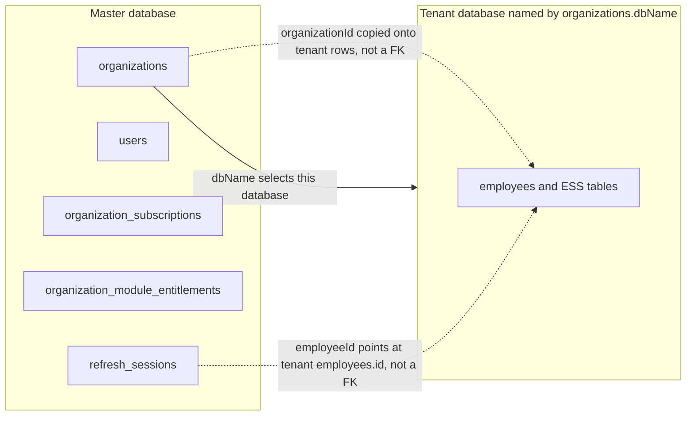

---

## Master database

Registered on the root connection:

| Entity | Table | Isolation |
| --- | --- | --- |
| `Organization` | `organizations` | Root tenant record. `subdomain` is unique. `dbName` names the tenant database. |
| `User` | `users` | `organizationId` FK, cascade delete. Unique `(email, organizationId)`. Platform users, including super admin. |
| `OrganizationSubscription` | `organization_subscriptions` | `organizationId` FK, cascade delete. `createdByUserId` is a uuid with **no** FK to `users`. |
| `PlatformModule` | `platform_modules` | Global catalog. `code` is unique. No organization column. |
| `OrganizationModuleEntitlement` | `organization_module_entitlements` | `organizationId` FK, cascade delete. Unique `(organizationId, moduleCode)`. `moduleCode` matches `platform_modules.code` in application code, not as a database FK. |
| `RefreshSession` | `refresh_sessions` | `organizationId` FK to `organizations` (nullable, cascade). `masterUserId` FK to `users` (nullable, cascade). `employeeId` is a nullable uuid with **no** FK, because the employee row is in the tenant database. `sessionKind` is `master` or `employee`. |
| `AuthHandoffToken` | `auth_handoff_tokens` | `refreshSessionId` FK, cascade delete. |
| `ContactUs` | `contact_us` | Marketing inbox. No organization FK. `id` is bigint. |
| `RequestForDemo` | `request_for_demo` | Marketing inbox. No organization FK. `id` is bigint. |

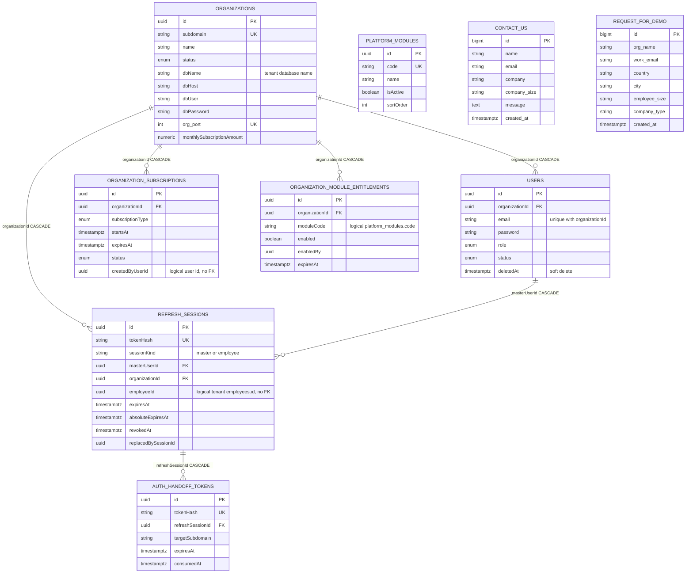

`PLATFORM_MODULES` is not drawn with a line to entitlements: the link is `moduleCode`, not a foreign key.

---

## Tenant database

Each tenant database is already one company. `organizationId` on a tenant row is a second isolation field: queries filter by it, and indexes usually lead with it. It is **not** a foreign key to master `organizations`.

Tables that do **not** declare `organizationId` are still tenant-scoped because they only exist inside that database. They hang off a parent row (`employeeId`, `timesheetDayId`, `assessmentId`, `dailySummaryId`, and so on).

Child tables with no `organizationId` column:

`employee_employment_details`, `employee_salary_details`, `employee_bank_details`, `employee_emergency_contacts`, `employee_access_control`, `employee_documents`, `employee_audit_logs`, `employee_reporting_managers`, `work_shift_sessions`, `timesheet_entries`, `attendance_sessions`, `performance_answers`, `leave_request_cc_recipients`, `organization_settings`, and the tenant RBAC tables (`rbac_roles`, `rbac_permissions`, `rbac_role_permissions`, `rbac_employee_role_assignments`, `rbac_permission_audit_logs`).

`rbac_permissions.moduleCode` is a string aligned with master `platform_modules.code`. It is not a foreign key.

### Employees, org structure, and onboarding documents

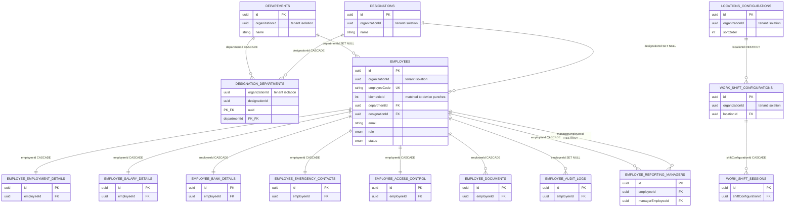

`employee_documents` is the onboarding file store (S3 key or legacy inline bytes). The Document Centre library is a different pair of tables, below.

### Leave and holidays

`organization_calendar_holidays.locationId` is a nullable uuid aimed at `locations_configurations`. The entity does not declare `@ManyToOne`, so it is not a database foreign key.

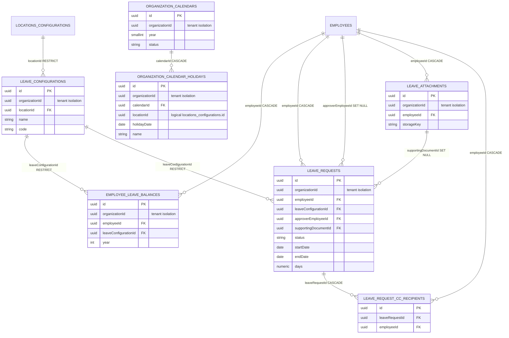

### Attendance and biometric devices

`attendance_punches.deviceId` stores a device id when the punch came from hardware. The punch entity does not declare a foreign key to `biometric_devices`.

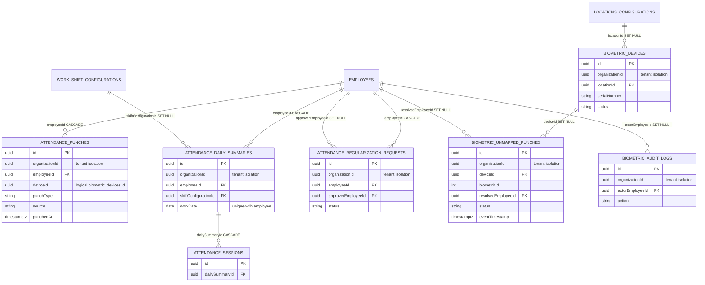

### Timesheets

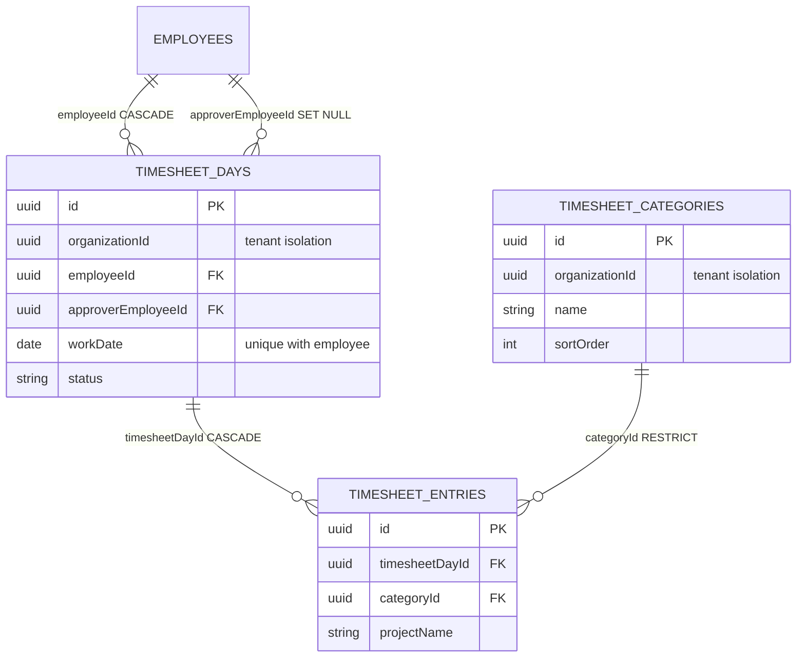

### Expenses

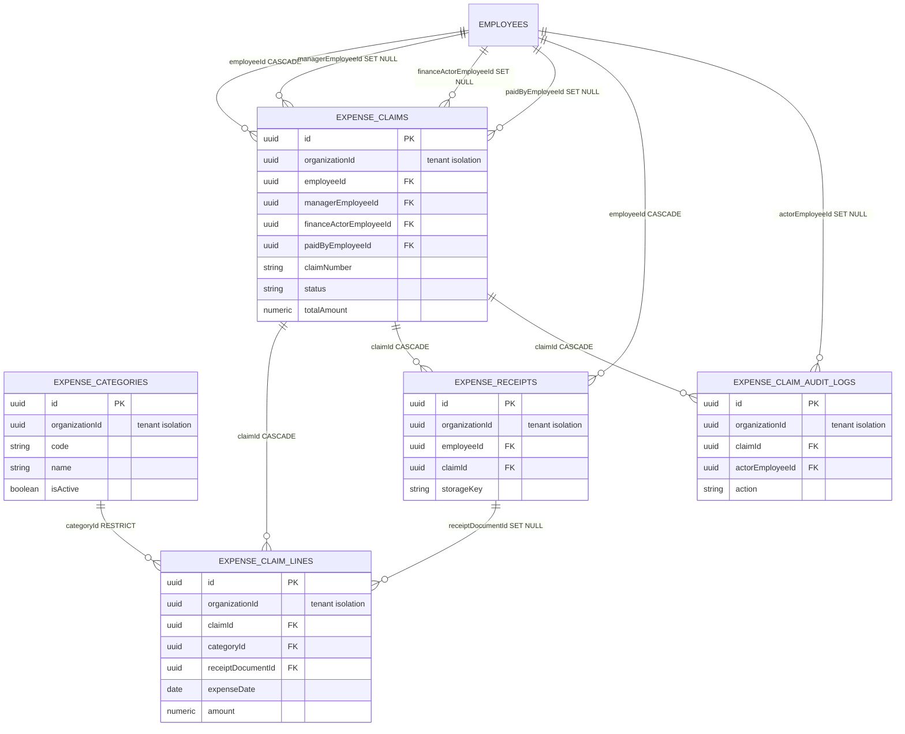

### Notifications

One inbox row can point at a leave request, an attendance regularization, or an expense claim. All three foreign keys are nullable and use `SET NULL` if the source row is removed. The recipient is always an employee (`CASCADE`).

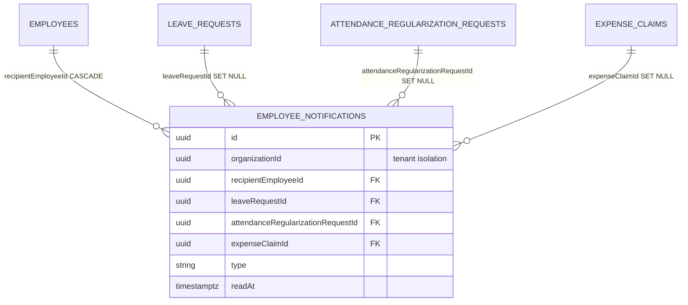

### Performance

`performance_sections.role` is a role label (`EMPLOYEE`, `MANAGER`, `HR`, or a custom RBAC role code). It is not a foreign key to `rbac_roles`.

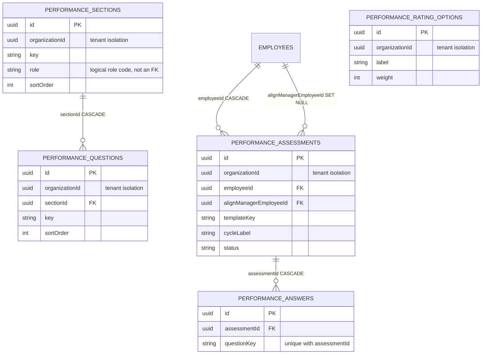

### Skills

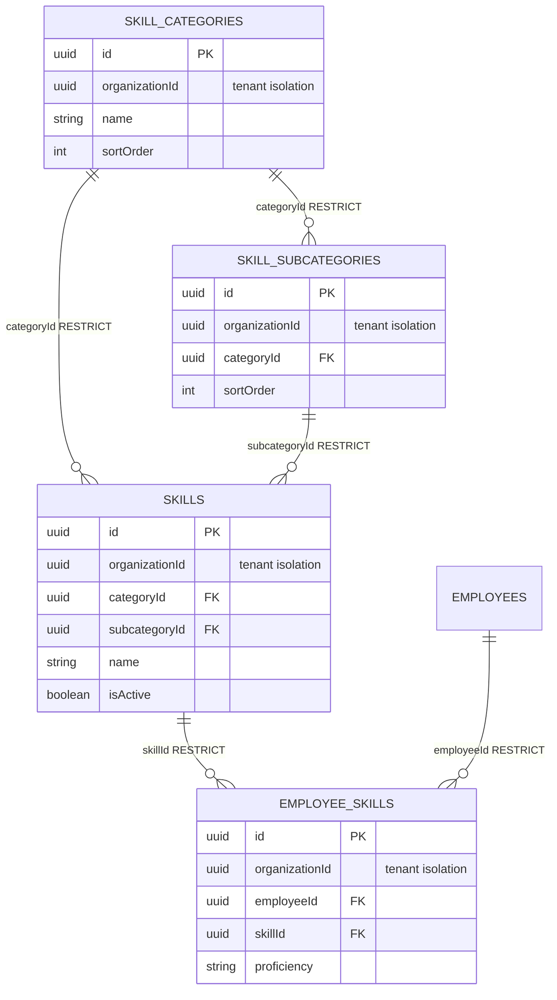

### Document Centre

Separate from `employee_documents`. Policies and forms have a null `employeeId`. Form 16 rows set `employeeId` to the person the certificate belongs to.

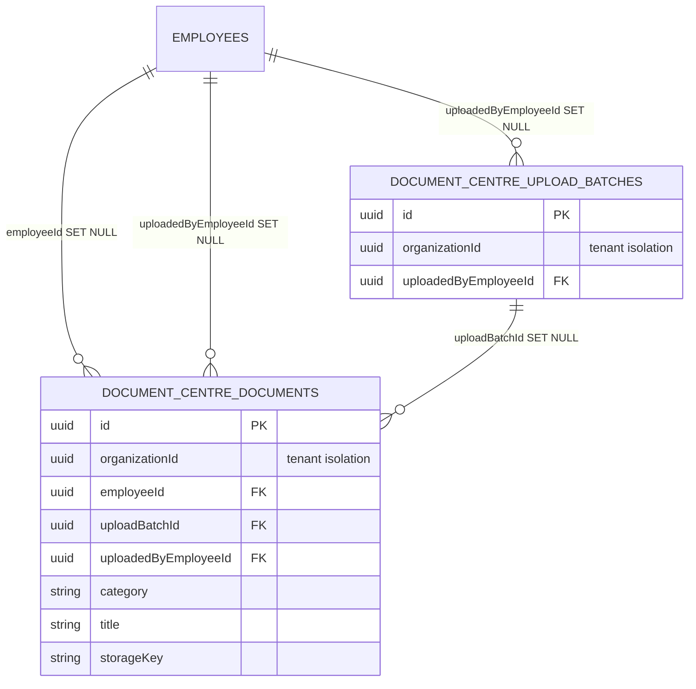

### Tenant RBAC and settings

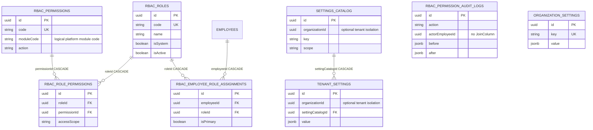

`organization_settings` is the key/value store the settings API actually reads (profile, attendance, timesheet policy, expense policy defaults). It has no `organizationId` because the tenant database is the boundary and `key` is unique inside it. `settings_catalog` and `tenant_settings` are the older catalog pair; both carry an optional `organizationId`.

---

## Foreign keys versus tenant isolation

| Kind | Where | Enforced by Postgres |
| --- | --- | --- |
| Master FK | `users.organizationId`, `organization_subscriptions.organizationId`, `organization_module_entitlements.organizationId`, `refresh_sessions.organizationId`, `refresh_sessions.masterUserId`, `auth_handoff_tokens.refreshSessionId` | Yes. Delete of an organization cascades to users, subscriptions, entitlements, and refresh sessions. |
| Tenant FK | Every `@JoinColumn` in the tenant diagrams (`employeeId`, `departmentId`, `claimId`, `skillId`, and the rest) | Yes, inside that tenant database only. |
| Tenant isolation column | `organizationId` on employees, ESS, attendance, timesheets, skills, documents, calendars, expense, performance, biometric, departments, designations, locations, shifts, leave config | No. Application code sets it to the master organization id. A wrong value does not violate a constraint. |
| Cross-database pointer | `refresh_sessions.employeeId` → tenant `employees.id` | No. |
| Code match, not a FK | `organization_module_entitlements.moduleCode` → `platform_modules.code`; tenant `rbac_permissions.moduleCode` → the same catalog code; `organization_calendar_holidays.locationId`; `attendance_punches.deviceId`; `organization_subscriptions.createdByUserId` | No. |
