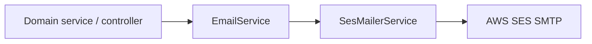

# Email module registry

Lookup doc for anyone sending or adding transactional email. Keep this file updated when you add a new mail type or consumer.

## Overview



| Piece | Role |
|-------|------|
| `EmailModule` | Nest module; exports `EmailService` |
| `EmailService` | High-level API: pick template, build subject/body, call mailer |
| `SesMailerService` | Low-level transport via **nodemailer** → **AWS SES SMTP**. Skips send if SES env is incomplete |

**Env (required for real sends):**

- `AWS_SES_SMTP_ENDPOINT`
- `AWS_SES_SMTP_PORT` (default `587`)
- `AWS_SES_SMTP_USERNAME`
- `AWS_SES_SMTP_PASSWORD`
- `AWS_SES_FROM_EMAIL`
- `AWS_SES_FROM_NAME` (optional, default `GhoulHR`)
- `APP_DOMAIN` (login URLs in welcome / activated mails)
- `SES_TEST_TO` (optional, for the test script)

**Manual test:**

```bash
npm run build
npm run test:email
npm run test:email -- you@example.com leave-applied
```

Script: [`scripts/send-test-email.cjs`](../../../scripts/send-test-email.cjs)

---

## Module file map

| File | Role |
|------|------|
| [`email.module.ts`](./email.module.ts) | Providers: `SesMailerService`, `EmailService`; exports `EmailService` |
| [`email.service.ts`](./email.service.ts) | Public send methods + DTOs |
| [`ses-mailer.service.ts`](./ses-mailer.service.ts) | nodemailer transporter → SES |
| [`index.ts`](./index.ts) | Re-exports module + service |
| [`templates/email-layout.util.ts`](./templates/email-layout.util.ts) | Shared HTML wrapper + `escapeHtml` |
| [`templates/employee-created.template.ts`](./templates/employee-created.template.ts) | Welcome / temp password |
| [`templates/account-activated.template.ts`](./templates/account-activated.template.ts) | First-login activation |
| [`templates/leave-applied.template.ts`](./templates/leave-applied.template.ts) | Approver notice |
| [`templates/leave-approved.template.ts`](./templates/leave-approved.template.ts) | Applicant approval notice |
| [`templates/timesheet-approved.template.ts`](./templates/timesheet-approved.template.ts) | Timesheet approval notice |
| [`templates/pending-leave-approval-reminder.template.ts`](./templates/pending-leave-approval-reminder.template.ts) | Month-end pending leave reminder for approvers |

---

## Who imports `EmailModule` today

| Nest module | File | Why |
|-------------|------|-----|
| Employees | [`src/employees/employees.module.ts`](../../employees/employees.module.ts) | Welcome credentials on create / HR onboarding |
| Auth | [`src/auth/auth.module.ts`](../../auth/auth.module.ts) | Account activated after first password change |
| ESS | [`src/ess/ess.module.ts`](../../ess/ess.module.ts) | Leave + timesheet approval mails; month-end pending leave reminders |

If your feature lives outside these three modules, import `EmailModule` into your Nest module first.

---

## Active send catalog (who is using)

| Email | `EmailService` method | Template | Recipient | Trigger | Call site |
|-------|----------------------|----------|-----------|---------|-----------|
| Welcome / credentials | `sendEmployeeCreated` | `employee-created` | New employee | `POST /employees`, `POST /employees/hr-onboarding` | [`employees.controller.ts`](../../employees/employees.controller.ts) → `notifyEmployeeCreated` |
| Account activated | `sendAccountActivated` | `account-activated` | Employee | First successful password change (`POST /auth/change-password`) | [`tenant-auth.service.ts`](../../auth/tenant-auth.service.ts) → `changePassword` (when newly activated) |
| Leave applied | `sendLeaveApplied` | `leave-applied` | Approver | Leave submit (`POST /ess/leave/requests`) | [`leave-notification.service.ts`](../../ess/leave/leave-notification.service.ts) → `notifyApproverOnLeaveApplied` |
| Leave approved | `sendLeaveApproved` | `leave-approved` | Applicant | Approver approve (`POST /ess/approvals/leave/:id/approve`) | [`leave-notification.service.ts`](../../ess/leave/leave-notification.service.ts) → `notifyApplicantOnDecision` (`APPROVED` only) |
| Timesheet approved | `sendTimesheetApproved` | `timesheet-approved` | Employee | Approve day / bulk approve (`POST /ess/approvals/timesheet/...`) | [`ess-timesheet.service.ts`](../../ess/timesheet/ess-timesheet.service.ts) → `sendTimesheetApprovedEmails` |
| Pending leave month-end reminder | `sendPendingLeaveApprovalReminder` | `pending-leave-approval-reminder` | Approver | Scheduled cron (09:00 org timezone, last 3 calendar days of month) | [`pending-leave-approval-reminder.service.ts`](../../ess/leave/pending-leave-approval-reminder.service.ts) |

### Subject patterns

| Method | Subject |
|--------|---------|
| `sendEmployeeCreated` | `Welcome to {org} — your account is ready` |
| `sendAccountActivated` | `Your {org} account is active` |
| `sendLeaveApplied` | `Leave request from {applicant} — approval required` |
| `sendLeaveApproved` | `Your {leaveType} request has been approved` |
| `sendTimesheetApproved` | `Timesheet approved for {date}` or `{n} timesheets approved` |
| `sendPendingLeaveApprovalReminder` | `Action needed: {n} leave request(s) pending before month end` |

---

## Candidates / not implemented (who gonna use)

These flows already exist in UI or API but **do not** send email yet. Prefer owning them in the listed module when you implement.

| Candidate | Intended owner | Notes / files |
|-----------|----------------|---------------|
| Gate welcome mail with `welcomeEmailEnabled` | Employees | Flag is stored ([`employee-access.entity.ts`](../../employees/entities/employee-access.entity.ts), onboarding UI [`StepAccess.jsx`](../../../../../frontend/ghoulhr/src/features/employees/onboarding/steps/StepAccess.jsx)) but **not checked** before `sendEmployeeCreated` |
| Leave CC / broadcast email | ESS leave | [`broadcastLeaveApplied`](../../ess/leave/leave-notification.service.ts) is **in-app only**; leave CC picker UI copy mentions email |
| Leave rejected email | ESS leave | `notifyApplicantOnDecision` handles reject for in-app; no mail branch |
| Timesheet rejected email | ESS timesheet | Reject paths exist; no `EmailService` call |
| Admin password-reset email | Employees | [`POST /employees/:id/reset-password`](../../employees/employees.controller.ts) returns temp password in API only |
| Org-admin provision welcome | Organizations / Employees | Org create with `adminEmail` provisions ORG_ADMIN; **no** `EmailService` call today |
| Forgot-password / invite / verify-email | Auth (future) | Not implemented |
| Attendance regularization reminder | ESS attendance | In-app notifications live (`REGULARIZATION_PENDING_APPROVAL` / `_APPROVED` / `_REJECTED`); SES email not in this slice |

---

## How to add a new email

Follow the existing pattern end-to-end:

1. **Template** — add `templates/<name>.template.ts` that returns `{ subject, text, html }` using [`email-layout.util.ts`](./templates/email-layout.util.ts) (`escapeHtml`, shared layout).
2. **Service API** — in [`email.service.ts`](./email.service.ts):
   - Add a `Send…EmailDto` interface
   - Add `async sendX(params): Promise<void>` that renders the template and calls `this.sesMailer.sendMail({ to, ...rendered })`
3. **Test harness** — register the template key in [`scripts/send-test-email.cjs`](../../../scripts/send-test-email.cjs) (`TEMPLATE_KEYS` + render branch).
4. **Wire consumer module** — if not already importing email:
   ```ts
   imports: [EmailModule, /* … */]
   ```
5. **Call site** — inject `EmailService` in the domain service/controller and call `sendX`. Prefer fire-and-forget with `void this.emailService.sendX(…)` when the primary request must not fail on mail errors (match existing employees/auth/timesheet style), or `await` when the leave notification service pattern is more appropriate.
6. **Update this registry** — add a row under **Active send catalog** (and remove/update the candidate row if you closed a gap).

### Minimal call-site sketch

```ts
void this.emailService.sendX({
  to: recipient.email,
  // …dto fields matching your Send…EmailDto
}).catch((err) => {
  // optional: log; do not block the business action
});
```

---

## Related frontend (no compose UI)

| Path | Relevance |
|------|-----------|
| `frontend/ghoulhr/src/features/employees/onboarding/steps/StepAccess.jsx` | “Send welcome email” toggle → `welcomeEmailEnabled` |
| Leave apply / CC picker | Mentions email for CC; backend is in-app only today |
| Change-password page | Indirectly triggers account-activated mail |
| Leave / timesheet approval panels | Trigger approval mails via ESS APIs |

There is no dedicated email settings page or compose form.
